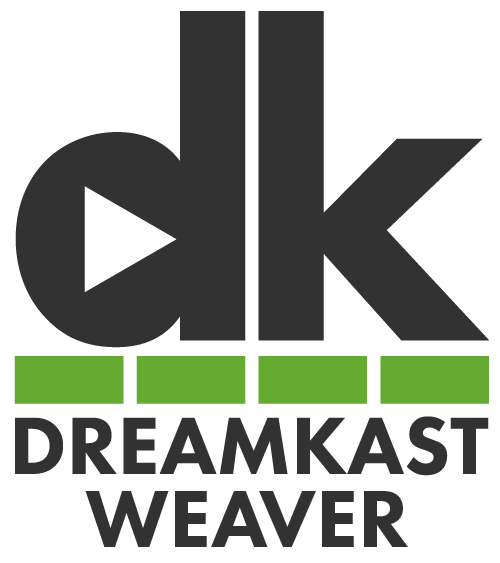

# dreamkast-weaver

Microservices for dreamkast built on Service Weaver.

<div align="center">

</div>

## Prerequisites

- Docker
- Docker Compose
- [Service Weaver](https://serviceweaver.dev/docs.html#installation)

## How to run 

Run the dev container and database:

```bash
docker-compose -f dev/compose.yaml up -d
```

Access `http://localhost:8080` then you can perform tests with a graphiql UI.

Dev app container supports live-reloading since it is running on [air](https://github.com/cosmtrek/air).
You don't need to rebuild the container image except for the case `go.mod` updated.


## Run on weaver

Dreamkast-weaver is built on Service Weaver, so you can try multi-deploy mode using weaver CLI.

- single deploy

```bash
DB_ENDPOINT=127.0.0.1 DB_PORT=13306 DB_USER=user DB_PASSWORD=password go run ./cmd/serve/main.go
weaver single status
```
-  multi deploy

```bash
make build
weaver multi deploy weaver.toml
weaver multi status
```

For more information about weaver, see [serverweaver.dev](https://serviceweaver.dev/docs.html).
